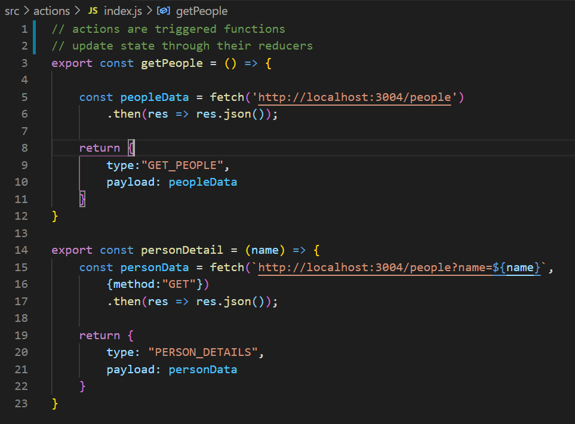
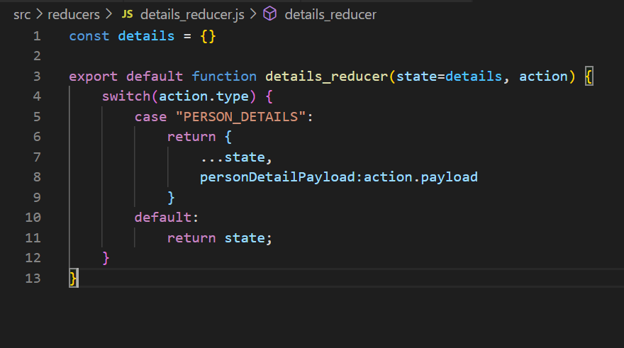
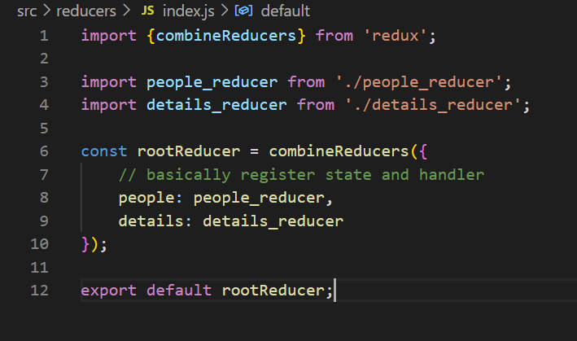
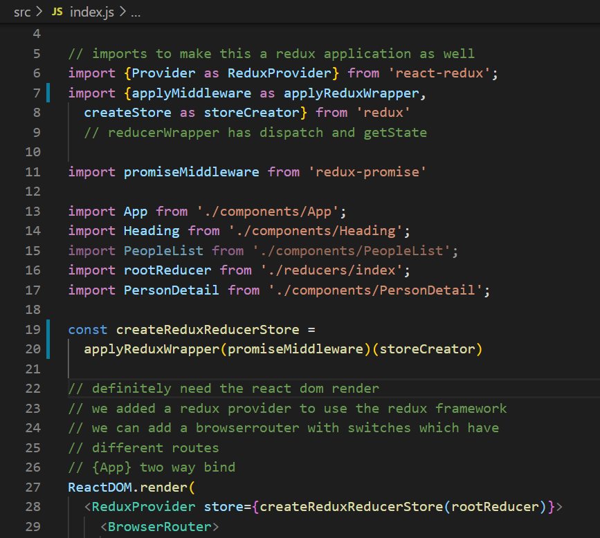
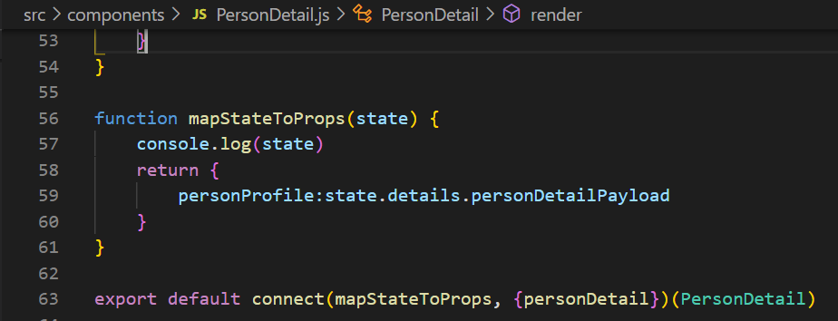
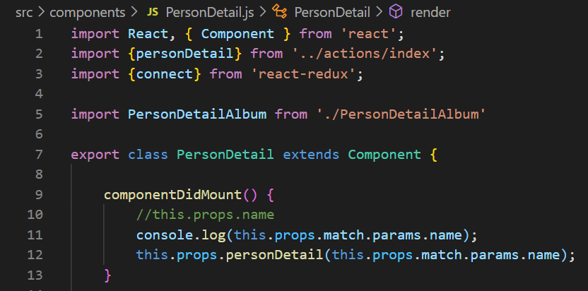
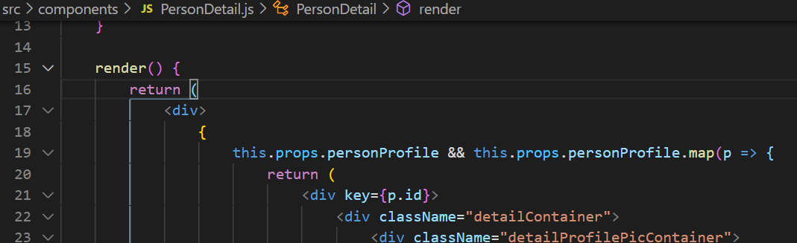

Forked starter assets from https://github.com/codeNesta/reactjs-essential-project-course
### Final App Screenshots
This is just a toy project to learn react and redux. It's not released and it will not be released.

### Redux Life Cycle
Purpose: To showcase and record my understanding of how to work with redux.

##### Make an action (event)
Event with something to do, id, and return data.

##### Make a reducer (event handler)
A reducer handles the action, passing back the state and action data to redux.

##### Register all the reducers (register the event handlers)
This only gives the reducer an id that the components can later reference inside the store to read the data back from the reducer.

##### Make a store (state/data holder) for the reducers and pass it to the components
All children components will receive access to the store and the reducers.

##### Register actions to reducer while subscribing callback to store the result in component property
I provide a callback function that updates a property in my component with the value of the data passed back to the state after the action is executed and the reducer updates the store.

##### Trigger the action

1. Redux sees that the action is registered with some store and triggered somewhere in my component. 
2. It passes the action to the reducers in the store. 
3. The reducers then check the id of the action before executing it.
4. The corresponding reducer returns a state and data.
5. Subscribed callback gets called and assigns state.reducerName.dataName to the component property given by the left side of the map. (Ex. propName: state.reducerName.dataName)
6. My component continues execution and uses data accordingly. (Ex. to render the component, or to redirect)

